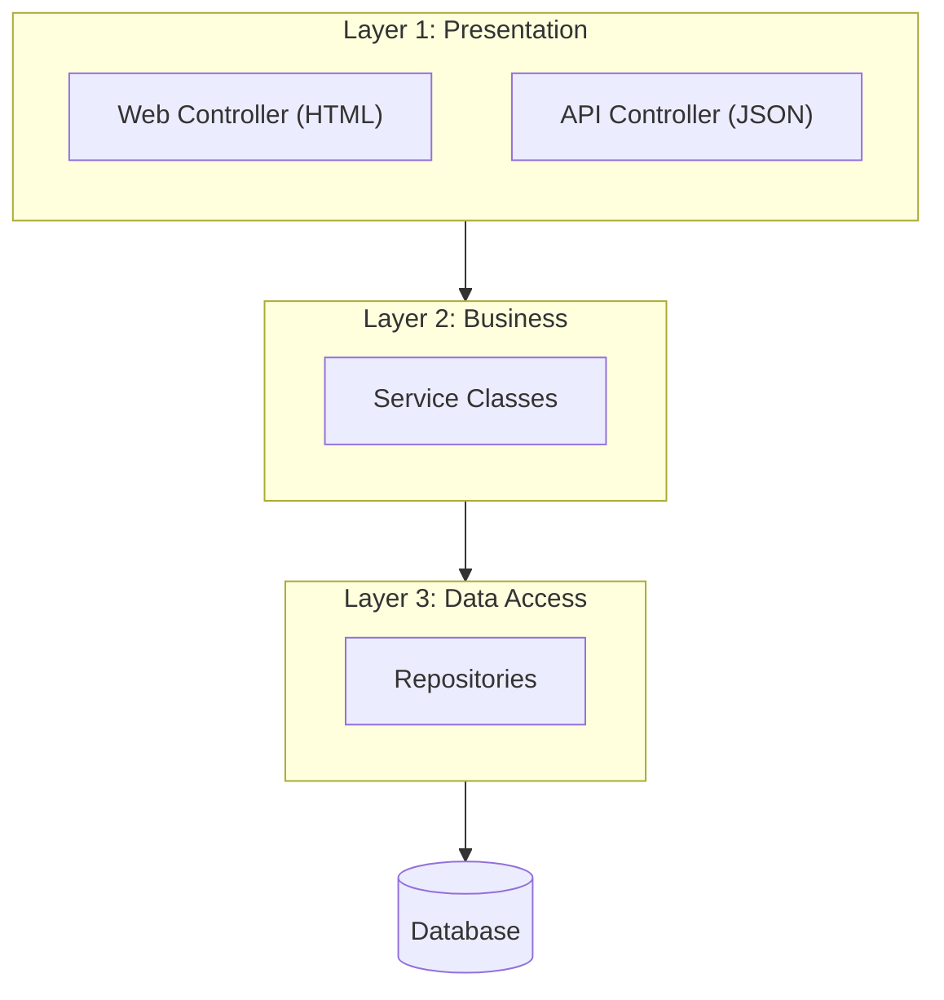

## [MAIN]: Brainstorming CPMSS Architecture

### The Core Decision: MVCS (3-Layered / "N-Tier" Style)

The user wants to keep it simple and not over-engineer. We are sticking to a standard **MVCS (Model-View-Controller-Service) Architecture**.

This is essentially the **3-Layer** pattern:
1.  **Presentation Layer** (Controller + View)
2.  **Service Layer** (Business Logic)
3.  **Repository/Data Layer** (Persistence)

**Key Insight:**
We explicitly use the term **MVCS** because it acknowledges that the "Model" is split into **Service** + **Repository**.

### Refined Architecture Diagram

---

## [TANGENT]: Clarifying Terminology

### N-Tier vs. Layered
*   **Layered:** Logical separation in code (what we are doing).
*   **N-Tier:** Physical separation on servers (what we are NOT doing).
*   **Conclusion:** We use "Layered Architecture", but colloquially "N-Tier" is often used to mean the same thing.

### "Upgraded MVC"
*   **Classic MVC:** Model does everything (Logic + Data).
*   **Our MVC (MVCS):** Model is split into **Service** + **Repository**. This is the "3-Layer" approach.

---

## [QUESTION]: What about hidden layers? (Integration, Security, etc.)

**User's Point:** "I feel like there is a hidden thing in here."

**Answer:**
There are indeed "cross-cutting concerns" or sub-components, but for our architecture, they fit *inside* or *around* the 3 main layers:
*   **Security:** Wraps the Presentation layer (Filters).
*   **Mappers:** likely live inside Presentation/Business to convert DTOs.
*   **Integration:** (If needed) lives alongside Repositories in Layer 3.

**Decision:**
Do NOT elevate these to full "Architecture Layers" in our diagram to avoid over-engineering. Keep the high-level view simple (3 Layers).

---
