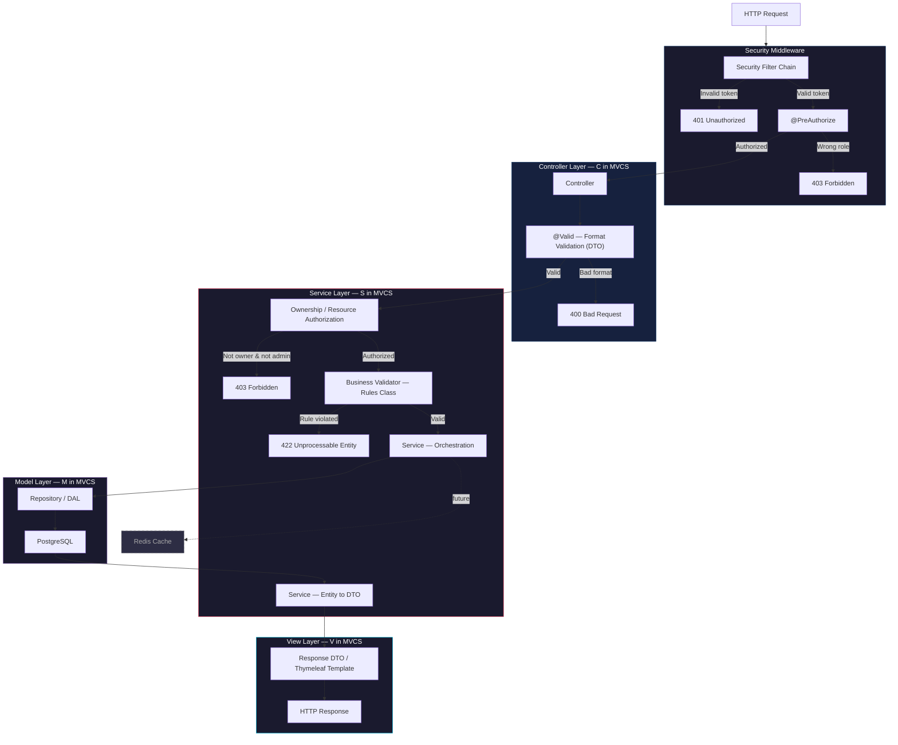
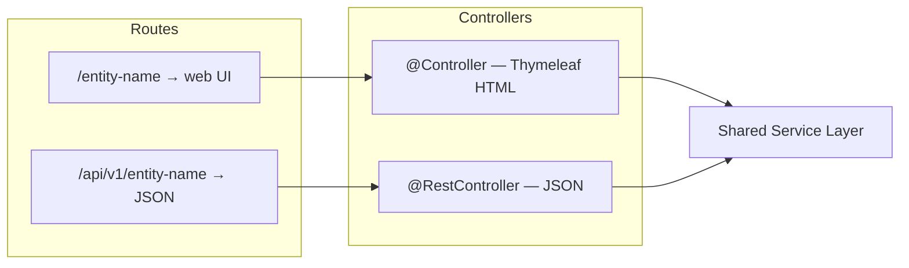
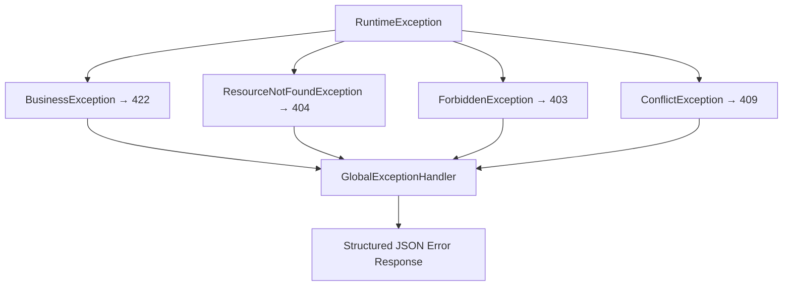

# Architecture

## Pattern & Style

**Pattern**: MVCS (Model-View-Controller-Service) — modified with explicit business
rule separation.

**Architecture**: N-Layer (Layered Architecture).

These are two different things. MVCS is how responsibilities are organized
*within* the code. N-Layer is how *dependencies flow* between layers — each
layer only talks to the one directly below it. The distinction matters: you can
swap out your controller style without touching your service layer.

---

## Request Lifecycle



### Database Constraints (Last Resort)

PostgreSQL enforces structural integrity independently of the application:

- Column types enforce data types (age is INTEGER — a string can never enter)
- `CHECK` constraints enforce value ranges
- `UNIQUE` constraints enforce uniqueness
- `NOT NULL` constraints enforce required fields
- Audit triggers: `created_at`, `updated_at` (structural only, never business rules)

---

## Hybrid API Design



---

## Code Structure (Feature-Based)

Feature-based over layer-based. Every feature is self-contained.

```
src/main/java/com/cpmss/
  │
  ├── config/
  │     SecurityConfig.java
  │     CorsConfig.java
  │     CacheConfig.java             ← Redis (future)
  │
  ├── common/
  │     BaseEntity.java              ← id, createdAt, updatedAt, createdBy, updatedBy
  │     GlobalExceptionHandler.java  ← @RestControllerAdvice
  │     ApiPaths.java                ← All route constants
  │     ApiResponse.java             ← Standard response envelope + PagedResponse<T>
  │
  ├── exception/
  │     BusinessException.java       ← 422
  │     ResourceNotFoundException.java ← 404
  │     ForbiddenException.java      ← 403
  │     ConflictException.java       ← 409
  │
  ├── util/
  │     DateUtils.java
  │     SlugUtils.java               ← Generate URL-friendly slugs from names
  │     MaskingUtils.java            ← National ID masking, bank account masking
  │     AuthUtils.java               ← Extract current user from security context
  │
  ├── {feature}/
  │     {Feature}.java               ← JPA Entity
  │     {Feature}Repository.java     ← Spring Data JPA interface (DAL)
  │     {Feature}Service.java        ← Orchestration + @Transactional
  │     {Feature}Rules.java          ← Business rules (explicit, testable)
  │     {Feature}Controller.java     ← Thymeleaf web controller
  │     {Feature}ApiController.java  ← REST controller
  │     {Feature}Mapper.java         ← MapStruct mapper
  │     dto/
  │       Create{Feature}Request.java
  │       Update{Feature}Request.java
  │       {Feature}Response.java
  │
  └── CpmssApplication.java
```

See [`CONVENTIONS.md`](./CONVENTIONS.md) for implementation patterns: `BaseEntity`,
entity annotations, `{Feature}Rules.java` contract, slug pattern, `PagedResponse<T>`,
`ApiPaths.java`, transaction boundaries, and MapStruct + Records.

---

## Centralized Routes (ApiPaths.java)

All endpoint strings live in one file. Controllers import constants, never
hardcode strings. This is the application-layer equivalent of `.proto` route
definitions — one place to see what the entire API surface looks like.

API versioning starts at `v1` from day one. A breaking change introduces
`/api/v2/...` while `v1` continues to operate.

---

## {Feature}Rules.java

Business rules are an explicit, testable first-class component — not buried in
the service. The service loads all necessary data, then passes it to the Rules
class before orchestrating the write. See [`CONVENTIONS.md`](./CONVENTIONS.md)
for the full contract and example.

---

## Exception Hierarchy



Error response format:

```json
{
  "status": 422,
  "error": "Unprocessable Entity",
  "message": "Domain rule violated",
  "timestamp": "2026-03-24T07:00:00Z"
}
```

Validation error format (format validation failures):

```json
{
  "status": 400,
  "error": "Validation Failed",
  "fields": {
    "email": "Must be a valid email address",
    "age": "Must be at least 18"
  }
}
```

HTML error pages for Thymeleaf routes — Spring Boot's `BasicErrorController`
automatically serves these when the request comes from a browser:

```
src/main/resources/templates/error/
  403.html
  404.html
  422.html
  500.html
```

---

## Transaction Boundaries

`@Transactional` is applied at the service layer. Service methods that call
multiple repository operations are wrapped in a single transaction — if any
step fails, all prior steps roll back automatically.

Read-only service methods use `@Transactional(readOnly = true)` for performance.
See [`CONVENTIONS.md`](./CONVENTIONS.md#transaction-boundaries) for the naming rule.

---

## Cross-Cutting Concerns

These apply across all layers and are not owned by any single layer.

| Concern | Implementation |
|---|---|
| Logging | SLF4J / Logback. Controller logs request entry. Service logs decisions. Exception handler logs errors with stack traces. |
| Exception Handling | `GlobalExceptionHandler` (`@RestControllerAdvice`) — catches all custom exceptions, maps to structured JSON. Thymeleaf routes get HTML error pages via `templates/error/`. |
| CORS | Configured in `SecurityConfig`. |
| Authentication | Stateless JWT. Token issued on login, validated on every request via Spring Security filter chain. CSRF disabled — no session cookies are issued. |
| Authorization | `@PreAuthorize` for role-based. Explicit ownership checks in service for resource-based. |
| Password Hashing | BCrypt via Spring Security. Raw passwords are never stored. |
| Refresh Tokens | Access token (short-lived) + refresh token (long-lived). Client uses refresh token to silently obtain a new access token. |
| Rate Limiting | Applied at Nginx level on auth endpoints (`/api/v1/auth/login`, `/api/v1/auth/refresh`). |
| Audit Fields | `BaseEntity` with `@CreatedDate`, `@LastModifiedDate`, `@CreatedBy`, `@LastModifiedBy`. Requires `AuditorAware` bean and `@EnableJpaAuditing`. |
| Data Masking | Sensitive fields returned masked in Response DTOs via `MaskingUtils`. Role-specific DTOs for different access levels. |
| Input Validation | Format: `@Valid` annotations on Request DTOs. Business: explicit Rules class per feature. |
| Pagination | All list endpoints accept `Pageable`. Service returns `PagedResponse<T>`. |
| Slugs | URL-friendly identifier on applicable entities. Generated by `SlugUtils` on create. |

---

## Future: Redis

Redis sits parallel to PostgreSQL as a cache layer. The service checks Redis
before hitting the database for expensive, frequently-read data.

Adding Redis requires a dependency, a config class, and `@Cacheable` annotations
on qualifying service methods. No structural changes to the architecture.
