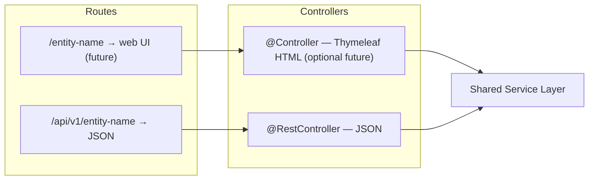
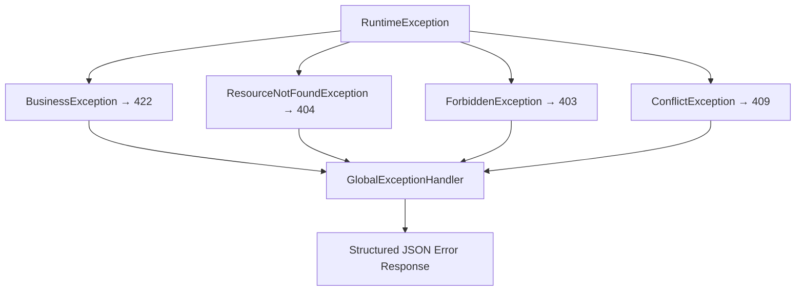

# Architecture

## Pattern & Style

**Pattern**: MVCS (Model-View-Controller-Service) — modified with explicit business
rule separation.

**Architecture**: N-Layer (Layered Architecture).

These are two different things. MVCS is how responsibilities are organized
*within* the code. N-Layer is how *dependencies flow* between layers — each
layer only talks to the one directly below it. The distinction matters: you can
swap out your controller style without touching your service layer.

---

## Request Lifecycle


### Database Constraints (Last Resort)

PostgreSQL enforces structural integrity independently of the application:

- Column types enforce data types (age is INTEGER — a string can never enter)
- `CHECK` constraints enforce value ranges
- `UNIQUE` constraints enforce uniqueness
- `NOT NULL` constraints enforce required fields
- Audit triggers: `created_at`, `updated_at` (structural only, never business rules)

See [DATABASE.md](./DATABASE.md) for schema design decisions, migration conventions, and rationale.

---

## API Design



The current backend implementation is REST-first. JSON `@RestController`
classes are the committed API surface. The Thymeleaf lane remains an optional
future extension and must not be documented as implemented until web
controllers and templates exist.

---

## Code Structure (DDD-Lite Bounded Contexts)

The source tree is organized by business context first, then by feature. Each
feature keeps the existing Spring MVCS shape internally: entity, repository,
service, rules, controller, mapper, and DTOs stay together. This keeps the
current implementation pattern while making the package boundaries easier to
scan as the system grows.

```
src/main/java/com/cpmss/
  │
  ├── communication/
  │     internalreport/
  ├── finance/
  │     bankaccount/
  │     installmentpayment/
  │     money/
  │     payment/
  │     payrollpayment/
  │     personinvestsincompound/
  │     workorderpayment/
  ├── hr/
  │     application/
  │     compensation/
  │     hireagreement/
  │     lawofshiftattendance/
  │     recruitment/
  │     staffposition/
  │     staffpositionhistory/
  │     staffprofile/
  │     staffsalaryhistory/
  ├── identity/
  │     auth/
  ├── leasing/
  │     common/
  │     contract/
  │     contractparty/
  │     installment/
  │     personresidesunder/
  ├── maintenance/
  │     company/
  │     personworksforcompany/
  │     workorder/
  │     workorderassignedto/
  ├── organization/
  │     department/
  │     departmentlocationhistory/
  │     departmentmanagers/
  │     personsupervision/
  ├── people/
  │     common/
  │     person/
  │     qualification/
  │     role/
  ├── performance/
  │     common/
  │     kpipolicy/
  │     staffkpimonthlysummary/
  │     staffkpirecord/
  │     staffperformancereview/
  ├── platform/
  │     common/                     ← base entities, API envelope, route constants
  │       value/                    ← shared scalar value types
  │     config/                     ← Spring Security, JWT, auditing
  │       CacheConfig.java          ← Redis (future)
  │     exception/                  ← application exception hierarchy
  │     util/                       ← date, auth, slug, and masking helpers
  ├── property/
  │     building/
  │     compound/
  │     common/
  │     facility/
  │     facilityhourshistory/
  │     facilitymanager/
  │     unit/
  │     unitpricinghistory/
  │     unitstatushistory/
  ├── security/
  │     accesspermit/
  │     entersat/
  │     gate/
  │     gateguardassignment/
  │     vehicle/
  ├── workforce/
  │     assignedtask/
  │     attends/
  │     common/
  │     shiftattendancetype/
  │     task/
  │     taskmonthlysalary/
  └── CpmssApplication.java
```

Feature packages follow this shape where the feature needs each component:

```
src/main/java/com/cpmss/{context}/{feature}/
  {Feature}.java                   ← JPA Entity
  {Feature}Repository.java         ← Spring Data JPA interface (DAL)
  {Feature}Service.java            ← Orchestration + @Transactional
  {Feature}Rules.java              ← Business rules (explicit, testable)
  {Feature}ApiController.java      ← REST controller
  {Feature}Mapper.java             ← MapStruct mapper
  dto/
    Create{Feature}Request.java
    Update{Feature}Request.java
    {Feature}Response.java
```

See [`CONVENTIONS.md`](./CONVENTIONS.md) for implementation patterns: `BaseEntity`,
entity annotations, domain value types, `{Feature}Rules.java` contract, planned
slug pattern, `PagedResponse<T>`, `ApiPaths.java`, transaction boundaries, and
MapStruct + Records.

---

## Domain Value Types

The DDD-lite package layout is paired with explicit domain value types for
business concepts that need validation or normalization. These types keep pure
invariants near the data they protect while preserving the existing layered
service pattern.

| Concept type | Java shape | Persistence shape |
|---|---|---|
| Finite vocabulary | `enum` plus `AttributeConverter` when labels differ | Existing string column |
| One-column scalar | `record` plus `AttributeConverter` | Existing single column |
| Multi-column concept | `@Embeddable` record/class | Existing column group |
| Cross-row workflow rule | Rules/service method | Repository-backed check |

Current examples include:

- `finance.money.Money` for amount and currency pairs.
- `finance.payment.PaymentType`, `PaymentDirection`, `PaymentMethod`, and
  `ReconciliationStatus` for payment vocabulary.
- Period/window value objects for dates and times across leasing, security,
  workforce, and property history.
- Identity/reference values such as email, phone, national ID, license plate,
  IBAN, SWIFT/BIC, payment number, and payment reference.
- KPI, payroll, compensation, and operational value objects for scores, rates,
  salary periods, areas, counts, status labels, and priority labels.

Pure checks such as non-negative money, date ordering, score bounds, identifier
format, and string normalization belong in these value objects. Rules that need
repositories or multiple aggregates remain in service/rules classes; examples
include one active staff position, one active department manager, permit
entitlement checks, payroll close freezing, and payment subtype orchestration.

---

## Centralized Routes (ApiPaths.java)

All endpoint strings live in one file. Controllers import constants, never
hardcode strings. This is the application-layer equivalent of `.proto` route
definitions — one place to see what the entire API surface looks like.

API versioning starts at `v1` from day one. A breaking change introduces
`/api/v2/...` while `v1` continues to operate.

---

## {Feature}Rules.java

Business rules are an explicit, testable first-class component — not buried in
the service. The service loads all necessary data, then passes it to the Rules
class before orchestrating the write. See [`CONVENTIONS.md`](./CONVENTIONS.md)
for the full contract and example.

---

## Exception Hierarchy



Error response format:

```json
{
  "status": 422,
  "error": "Unprocessable Entity",
  "message": "Domain rule violated",
  "timestamp": "2026-03-24T07:00:00Z"
}
```

Validation error format (format validation failures):

```json
{
  "status": 400,
  "error": "Validation Failed",
  "fields": {
    "email": "Must be a valid email address",
    "age": "Must be at least 18"
  }
}
```

HTML error pages for future Thymeleaf routes can be served by Spring Boot's
`BasicErrorController` when browser-facing controllers are introduced:

```
src/main/resources/templates/error/
  403.html
  404.html
  422.html
  500.html
```

---

## Transaction Boundaries

`@Transactional` is applied at the service layer. Service methods that call
multiple repository operations are wrapped in a single transaction — if any
step fails, all prior steps roll back automatically.

Read-only service methods use `@Transactional(readOnly = true)` for performance.
See [`CONVENTIONS.md`](./CONVENTIONS.md#transaction-boundaries) for the naming rule.

---

## Cross-Cutting Concerns

These apply across all layers and are not owned by any single layer.

| Concern | Implementation |
|---|---|
| Logging | SLF4J / Logback. Controller logs request entry. Service logs decisions. Exception handler logs errors with stack traces. |
| Exception Handling | `GlobalExceptionHandler` (`@RestControllerAdvice`) — catches all custom exceptions and maps them to structured JSON. HTML error pages are future Thymeleaf work. |
| CORS | Configured in `SecurityConfig`. |
| Authentication | Stateless JWT. Token issued on login, validated on every request via Spring Security filter chain. CSRF disabled — no session cookies are issued. |
| Authorization | `@PreAuthorize` for role-based. Explicit ownership checks in service for resource-based. |
| Password Hashing | BCrypt via Spring Security. Raw passwords are never stored. |
| Refresh Tokens | Access token (short-lived) + refresh token (long-lived). Client uses refresh token to silently obtain a new access token. |
| Rate Limiting | Applied at Nginx level on auth endpoints (`/api/v1/auth/login`, `/api/v1/auth/refresh`). |
| Audit Fields | `BaseEntity` with `@CreatedDate`, `@LastModifiedDate`, `@CreatedBy`, `@LastModifiedBy`. Requires `AuditorAware` bean and `@EnableJpaAuditing`. |
| Data Masking | Sensitive fields returned masked in Response DTOs via `MaskingUtils`. Role-specific DTOs for different access levels. |
| Input Validation | Format: `@Valid` annotations on Request DTOs. Business: explicit Rules class per feature. |
| Pagination | All list endpoints accept `Pageable`. Service returns `PagedResponse<T>`. |
| Slugs | Planned URL-friendly identifiers for named/catalog resources. `SlugUtils` exists, but slug columns and lookup endpoints are future work. |

---

## Future: Redis

Redis sits parallel to PostgreSQL as a cache layer. The service checks Redis
before hitting the database for expensive, frequently-read data.

Adding Redis requires a dependency, a config class, and `@Cacheable` annotations
on qualifying service methods. No structural changes to the architecture.
