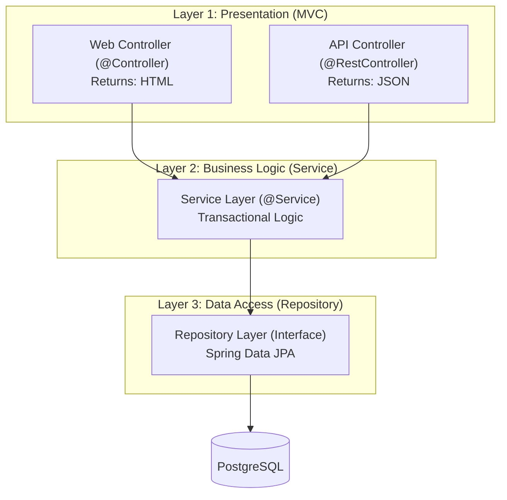
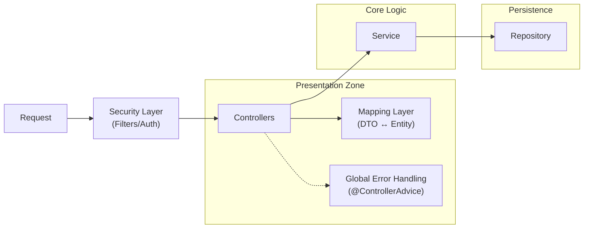

## Architecture Pattern: MVCS (Model-View-Controller-Service)

We use a **Layered MVCS Architecture**. This is an evolution of standard MVC that splits the "Model" into two distinct layers: **Service** (Logic) and **Repository** (Data).

### The High-Level Structure



### The "Hidden" Layers (Real-World Architecture)

Beyond the standard 3 layers, we explicitly acknowledge the "glue" that holds production apps together:



### Strict Layer Rules

1.  **Presentation (Web/API):**
    *   **NEVER** call Repositories directly.
    *   **ALWAYS** return DTOs (API) or Views (Web), never raw Entities.
    *   **role:** Validate input, map to DTOs, call Service.

2.  **Business (Service):**
    *   **NEVER** return HTML or HTTP specific objects (ResponseEntity).
    *   **role:** Transactional boundaries, business rules, orchestration.

3.  **Data (Repository):**
    *   **NEVER** contain business logic.
    *   **role:** Pure database access (CRUD).

---

## Tech Stack

| Layer | Technology |
|-------|------------|
| Framework | Spring Boot 3.x |
| Web Views | Thymeleaf |
| API | REST (JSON) |
| ORM | Spring Data JPA (Hibernate) |
| Database | PostgreSQL 16 |
| Auth | Spring Security |
| Build | Gradle |
| Containers | Docker Compose |

---

## Controller Patterns

### Web Controller (Thymeleaf)

```java
@Controller
@RequestMapping("/staff")
public class StaffWebController {
    private final StaffService service;

    @GetMapping
    public String list(Model model) {
        model.addAttribute("staff", service.findAll());
        return "staff/list";  // → templates/staff/list.html
    }
}
```

### API Controller (REST)

```java
@RestController
@RequestMapping("/api/staff")
public class StaffApiController {
    private final StaffService service;

    @GetMapping
    public List<StaffDto> list() {
        return service.findAll();  // → JSON
    }
}
```

### Shared Service

```java
@Service
public class StaffService {
    private final StaffRepository repository;

    public List<Staff> findAll() {
        return repository.findAll();
    }
}
```

---

## URL Routes

| Type | URL | Returns |
|------|-----|---------|
| Web | `/staff` | HTML page |
| Web | `/staff/{id}` | HTML page |
| API | `/api/staff` | JSON array |
| API | `/api/staff/{id}` | JSON object |

---

## Folder Structure

```
src/main/
├── java/com/cpmss/
│   ├── CpmssApplication.java
│   ├── config/               # Security, CORS, etc.
│   └── [feature]/            # Feature modules
│       ├── FeatureEntity.java
│       ├── FeatureRepository.java
│       ├── FeatureService.java
│       ├── FeatureWebController.java   # @Controller
│       ├── FeatureApiController.java   # @RestController
│       └── dto/
│           └── FeatureDto.java
│
└── resources/
    ├── application.yml
    ├── templates/            # Thymeleaf views
    ├── static/               # CSS, JS, images
    └── db/migration/         # Flyway SQL
```

> **TODO:** Define actual features based on requirements.

---

## Testing

| Layer | Annotation | Purpose |
|-------|------------|---------|
| Web Controller | `@WebMvcTest` | View rendering, forms |
| API Controller | `@WebMvcTest` | JSON responses |
| Service | JUnit + Mockito | Business logic |
| Repository | `@DataJpaTest` | Custom queries |
| Full flow | `@SpringBootTest` | Integration |
