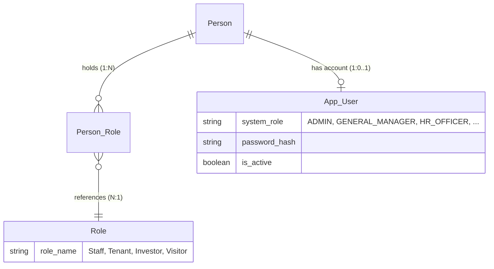

# Database

Schema design decisions, migration conventions, and deployment approach for CPMSS.

---

## Flyway Migration Convention

Every schema change and seed operation is a versioned Flyway migration file.
Flyway runs on application startup and applies any pending files in version order.

```
src/main/resources/db/migration/
  V1__create_initial_tables.sql              ← DDL: all CREATE TABLE statements
  V2__add_constraints.sql                    ← Deferred CHECKs for V1 tables
  V3__add_auth_tables.sql                    ← App_User table (authentication)
  V4__add_auth_constraints.sql               ← App_User CHECK constraints (12 system roles)
  V5__add_team_name.sql                      ← Adds team_name to Person_Supervision
  V6__add_internal_report.sql                ← Internal_Report table (ticketing system)
  V7__add_internal_report_constraints.sql    ← Deferred CHECKs for V6 (paired)
```

| File | Runs in prod? | Purpose |
|---|---|---|
| `V1`–`V7` | All environments | Current schema structure, auth tables, constraints, and internal reports |
| Future `V8+` | All environments | New schema changes or required reference data |
| Future `R__seed_dev_data.sql` | Dev only | Fixed fake records for local dev and testing only |

**Rules:**
- After the schema is shared or released, never modify a committed versioned
  migration — Flyway checksums them. Add a new `Vn__` file instead.
- During first-version baseline work, a branch may deliberately edit existing
  migrations when the database will be reset with `docker-compose down -v`.
  Document that choice in the commit body.
- `V3`/`V4` (auth) follow the same DDL → constraints pattern as `V1`/`V2`.
- `V5` adds `team_name` to `Person_Supervision`.
- `V6`/`V7` add `Internal_Report` and its deferred constraints.
- `R__` stands for **Repeatable** — Flyway re-runs it whenever the file content changes (checksum-based). You can edit it freely. Used only in `dev` profile.
- A `CommandLineRunner` for randomised bulk demo data is planned but not implemented.

**Adding new tables (repeating pattern):**

Every new batch of tables follows the same DDL → constraints → seed sequence:

| File | Purpose |
|---|---|
| `Vn__add_{feature}_tables.sql` | DDL only — `CREATE TABLE` statements with `[Vn+1]` comments tracking pending constraints |
| `Vn+1__add_{feature}_constraints.sql` | `ALTER TABLE` CHECK constraints for those tables |
| `Vn+2__seed_{feature}_data.sql` | Catalog/reference data for those tables — **only if the feature requires it** |

Seeding is optional. Not every feature needs reference data. Add a seed migration only when the app cannot function without those rows.

---

## Schema Design Decisions

| Decision | Choice |
|---|---|
| Primary keys | `UUID DEFAULT gen_random_uuid()` on all mapped tables |
| Audit columns | `created_at TIMESTAMPTZ`, `updated_at TIMESTAMPTZ`, `created_by VARCHAR(255)`, `updated_by VARCHAR(255)` on every `@Entity` table |
| Business logic | Java service layer only — no PL/pgSQL triggers |
| CHECK constraints | All go to V2 — V1 is pure DDL (column types, NOT NULL, PK, FK, UNIQUE only) |
| Date-only fields | `DATE` — for facts with day-level precision: birthdays, contract dates, effective dates |
| Event timestamps | `TIMESTAMPTZ` — for precise moments with timezone: audit fields, payment events |
| Total participation | Enforced in the service layer (`@Transactional`) — `DEFERRABLE INITIALLY DEFERRED` constraint triggers are a valid PostgreSQL alternative but are deliberately not used here. Logic stays in Java where it is testable and explicit. |
| Domain values | Java value objects, enums, embeddables, and converters mirror schema constraints without changing table names or API routes |
| Money | Monetary facts use explicit amount and currency columns when the domain requires currency-aware behavior |

### Constraint Types

All CHECK constraints are deferred to `V2__add_constraints.sql` — V1 is pure DDL. Each constraint belongs to one of these types:

| Type | When to use |
|---|---|
| Enum check | Value must be one of a fixed set: `column IN ('ValueA', 'ValueB', ...)` |
| Range check | Numeric or date boundaries: `column > 0`, `end_column > start_column` |
| Format check | Pattern or length validation: `LENGTH(column) = N` |
| Mutual exclusion | Exactly one of several nullable columns must be NOT NULL. Two syntax options — see below. |
| Cross-column rule | Two columns in the same row must satisfy a structural rule: `col_a != col_b` |
| Domain pair | Two or more columns form one Java value object: `amount + currency`, `start_date + end_date`, `start_time + end_time` |
| Partial unique index | Uniqueness enforced only among rows that match a condition |

#### Mutual exclusion — two approaches

Two SQL forms are available. **Option B is the chosen standard.**

**Option A — OR-based** (2 columns only):
```sql
CHECK (
    (col_a IS NOT NULL AND col_b IS NULL) OR
    (col_a IS NULL     AND col_b IS NOT NULL)
)
```

**Option B — cast trick** (any number of columns):
```sql
CHECK (
    (col_a IS NOT NULL)::int +
    (col_b IS NOT NULL)::int +
    (col_c IS NOT NULL)::int = 1
)
```

`IS NOT NULL` casts to 1 or 0; the sum must equal exactly 1. Scales linearly — Option A does not.

### Tracking Pending Constraints in DDL Migrations

Every DDL migration (`Vn__add_{feature}_tables.sql`) tracks its paired constraints inline as commented-out `ALTER TABLE` statements, tagged `[Vn+1]`. The tag is not V2-specific — it always refers to the **next constraints migration** for that batch of tables.

**The pattern:**
- `V1` tables carry `[V2]` comments → constraints land in `V2__add_constraints.sql`
- `V3` tables carry `[V4]` comments → constraints land in `V4__add_{feature}_constraints.sql`
- And so on for every future DDL batch.

Place the comment block **immediately after the relevant column**, never outside the `CREATE TABLE` block. Both the tag comment and the `ALTER TABLE` block are removed once the paired constraints migration is written and applied.

```sql
CREATE TABLE Example (
    col_a VARCHAR(50) NOT NULL,
    -- [Vn+1]
    -- Structural check: [what the constraint enforces — data integrity perspective].
    -- Type: enum check
    -- ALTER TABLE Example
    --     ADD CONSTRAINT chk_example_col_a CHECK (
    --         col_a IN ('ValueA', 'ValueB')
    --     );
    col_b DECIMAL(12, 2) NOT NULL,
    -- [Vn+1]
    -- Business rule: [what the business policy requires].
    -- Type: range check
    -- ALTER TABLE Example
    --     ADD CONSTRAINT chk_example_col_b CHECK (
    --         col_b > 0
    --     );
    col_c UUID,
    -- [Vn+1]
    -- Structural check + Business rule: [when the constraint is both data integrity and policy].
    -- Type: cross-column rule
    -- ALTER TABLE Example
    --     ADD CONSTRAINT chk_example_col_c CHECK (
    --         col_c != other_col
    --     );
);
```

> If the constraint requires deeper explanation than a one-liner allows, add a `Note:` line in the table comment above the `CREATE TABLE` — consistent with the [Table Comment Standards](#table-comment-standards) below.

---

### Foreign Key Syntax

| FK type | Style |
|---|---|
| Single-column FK | Inline `REFERENCES` — declared on the column line itself |
| Composite FK (two or more columns) | Table-level `CONSTRAINT fk_name FOREIGN KEY (col1, col2) REFERENCES Table(col1, col2)` |

---

## Table Comment Standards

Every table has a classification comment above its `CREATE TABLE` statement.
The last line before `CREATE TABLE` is always the audit line (if the table has audit columns).

### Core entity (also called: anchor entity)
```sql
-- Core entity: [one-line description of what this entity represents].
-- Note: [total participation rule if applicable] — enforced transactionally in the service layer.
-- Audit columns capture when the record was added or changed, and which authenticated user did it.
CREATE TABLE ...
```

### Owned entity
An entity that requires a parent to exist at creation but is independently managed — it has its own
lifecycle, UUID primary key, and is referenced by other tables. Distinct from a Child table (which is
a multi-value attribute with no identity outside its parent).
```sql
-- Owned entity: [one-line description] — owned by [Parent], cannot exist without it.
-- Note: [any participation or deletion policy rule if applicable].
-- Audit columns capture when the record was added or changed, and which authenticated user did it.
CREATE TABLE ...
```

### Child / attribute table
```sql
-- Child table: stores multiple [X] values for a single [Parent] (multi-value attribute).
-- No audit columns — managed as part of the parent entity lifecycle.
CREATE TABLE ...
```

### Catalog table
```sql
-- Catalog table: defines [X] in the system (e.g. 'A', 'B').
-- Audit columns capture when the record was added or changed, and which authenticated user did it.
CREATE TABLE ...
```

### Junction table (full @Entity)
```sql
-- Junction table: [relationship description] (M:M — reason).
-- Full @Entity (not a silent @JoinTable) because [reason requiring audit or extra data].
-- Note: [total participation rule if applicable] — enforced transactionally in the service layer.
-- Audit columns capture when the record was added or changed, and which authenticated user did it.
CREATE TABLE ...
```

### Detail table — 1:1 extension (also called: sibling entity)
```sql
-- Detail table (1:1 extension of [Parent]): holds [Role]-specific attributes.
-- Only [Parents] with the '[Role]' role/type have a row here.
-- Note: enforcing this is a business rule in [X]Service (@Transactional) + [X]Rules.java.
-- Audit columns capture when the record was added or changed, and which authenticated user did it.
CREATE TABLE ...
```

### SCD Type 2 history table
```sql
-- Detail-History table: tracks [X] over time (SCD Type 2).
-- end_date IS NULL = currently active.  ORDER BY effective_date DESC LIMIT 1 = current value.
-- Audit columns capture when the record was added or changed, and which authenticated user did it.
CREATE TABLE ...
```

### Silent bridge table (no @Entity)
```sql
-- Bridge table: [relationship] (M:M — purely structural, no extra data or audit needed).
-- Managed as @ManyToMany @JoinTable in Java — no corresponding @Entity class.
CREATE TABLE ...
```

### Note: Convention

A `Note:` line signals a constraint or design decision that cannot be expressed structurally in DDL alone. Use it when a reader would not otherwise know the rule exists or where it is enforced.

| When to use | Example |
|---|---|
| Total participation / chicken-and-egg | `Note: [rule] — enforced in [X]Service + [X]Rules.java.` |
| Constraint enforced only in Java | `Note: [description] — enforced transactionally in the service layer.` |
| Constraint split between Java and a migration file | `Note: [description] — enforced in [X]Rules.java and V2__add_constraints.sql.` |
| Architectural policy (e.g. no physical deletion) | `Note: [records] are permanent — closed by status change, never deleted.` |

When the note has a continuation, indent to align with the note text:

```sql
-- Note: [entity] covers exactly one [constraint description].
--       [Rule] is enforced in [X]Rules.java and V2__add_constraints.sql.
```

---

## Temporal History (SCD Type 2)

Some facts change over time and the history must be preserved. Instead of updating a row, a new row is appended with an effective date. The old row is never touched.

```sql
-- Current value: end_date IS NULL  OR  ORDER BY effective_date DESC LIMIT 1
-- Historical value: WHERE effective_date <= :targetDate ORDER BY effective_date DESC LIMIT 1
```


---

## System Bootstrap

The first admin user is created via a **first-run HTTP endpoint** (`POST /setup`):

- Accessible only when the user table is empty — returns `404` permanently after first use.
- Usable from a browser (IT person on deployment day) or via `curl` from Jenkins.
- The created account is flagged `force_password_change = true` — first login forces a password change.

```bash
# Jenkins deploy stage — automated first-admin creation
sleep 10
curl -sf -X POST http://localhost:8080/setup \
     -H "Content-Type: application/json" \
     -d "{\"email\": \"admin@compound.com\", \"password\": \"${BOOTSTRAP_PASSWORD}\"}"
```

`BOOTSTRAP_PASSWORD` is a Jenkins credential — never hardcoded.

---

## Role Architecture: Business Roles vs System Roles

The schema deliberately separates **two independent role concepts** into different tables. This is a design decision, not an oversight — they answer different questions and have different lifecycles.

### The two axes

| Axis | Table | Question it answers | Example values |
|---|---|---|---|
| **Business role** | `Person_Role` (junction → `Role`) | *"What is this person in the compound?"* | Staff, Tenant, Investor, Visitor |
| **System role** | `App_User.system_role` | *"What can this person do in the software?"* | ADMIN, GENERAL_MANAGER, HR_OFFICER, ACCOUNTANT, SECURITY_OFFICER, FACILITY_OFFICER, DEPARTMENT_MANAGER, SUPERVISOR, GATE_GUARD, STAFF, INVESTOR, APPLICANT |

### Why they cannot be the same thing

A **business role** is a real-world fact: "Ahmed is a staff member who also rents a unit." He has two `Person_Role` rows: Staff + Tenant. This is about *who he is* in the compound.

A **system role** is a software permission: "Ahmed can manage his department's tasks and attendance." He has one `App_User` row with `system_role = 'DEPARTMENT_MANAGER'`. This is about *what the software lets him do*.

These are independent:

| Person | Business roles (Person_Role) | System role (App_User) | Login? |
|---|---|---|---|
| Compound Owner | Staff | GENERAL_MANAGER | ✅ |
| HR Manager | Staff | HR_OFFICER | ✅ |
| Team Lead | Staff | SUPERVISOR | ✅ |
| Security Guard | Staff | GATE_GUARD | ✅ |
| System Admin | *(none — no Person record yet)* | ADMIN | ✅ |
| Investor | Investor | INVESTOR | ✅ |
| Job Applicant | *(none initially)* | APPLICANT | ✅ |
| Tenant's child | Tenant *(via parent's contract)* | *(no App_User row)* | ❌ |
| Visiting plumber | Visitor | *(no App_User row)* | ❌ |

### Why they live in different tables

| Reason | Detail |
|---|---|
| **Not every Person logs in** | Tenants, visitors, children, contractors — all Persons, none use the software. Adding auth columns to Person would leave them NULL for most rows. |
| **Bootstrap chicken-and-egg** | The first admin (`POST /setup`) is created when Person is empty. `App_User.person_id` is nullable for this reason — the admin account exists before any Person does. |
| **Different lifecycles** | A Person can exist for years before getting login access (e.g. a tenant becomes a staff member). An App_User can be deactivated (`is_active = false`) without touching the Person record. |
| **Security isolation** | Password hashes live in `App_User`, not `Person`. Queries against Person data never accidentally expose credentials. |
| **M:N vs 1:1** | A Person can hold *multiple* business roles simultaneously (Staff + Tenant). But a Person has at most *one* system login account. Different cardinalities → different table structures. |

### How they connect



The service layer bridges them: when `PersonService` assigns the Staff role to a Person, a separate call to `AppUserService` can create their login account. These are two distinct operations — having a business role does not automatically grant software access.

---

## Planned File Storage

Binary files (CVs, documents, images) should be stored in **MinIO**, not in
PostgreSQL. The database column holds only the object path or presigned URL —
never file bytes.

```sql
file_url VARCHAR(500)  -- object path, e.g. "resource-type/record-id/filename.ext"
```

MinIO is an S3-compatible self-hosted object storage server running as a Docker
service (see [DEVOPS.md](./DEVOPS.md)). The Java upload/download service is
planned work. Once it exists, it will upload via the MinIO SDK and store the
returned path in the DB column.
Switching to AWS S3 later = change the endpoint URL and credentials only — no
schema or code logic changes.
