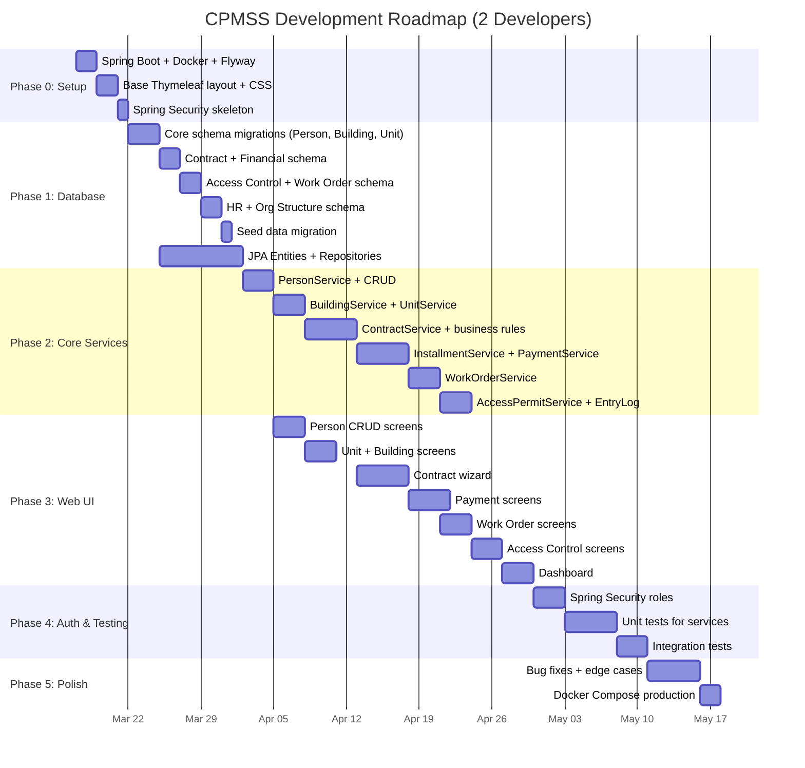

# CPMSS — Project Roadmap & Engineering Plan

> **Team:** 2 developers · **Architecture:** Spring Boot 3.x MVCS · **Database:** PostgreSQL 16
> **System:** Single-compound, staff-only internal tool

---

## Blunt Time Estimate

| Scenario | Calendar Time | Effort |
|---|---|---|
| **Full-time (8h/day, 2 people)** | **10–14 weeks** | ~1,200 hours total |
| **Part-time / university (3h/day, 2 people)** | **5–7 months** | Same effort, stretched |
| **If you cut scope to MVP (see below)** | **6–8 weeks full-time** | ~600 hours |

### Why this long?

| Work Item | Effort (2-person team) | Why |
|---|---|---|
| Project setup + Docker + CI skeleton | 3–4 days | Boilerplate but must be solid |
| Database schema (25+ tables) + Flyway migrations | 5–7 days | You already designed the ER, but writing SQL + JPA entities takes time |
| Service layer (10 modules × business rules) | 3–4 weeks | The bulk of the work — every business rule is code |
| Thymeleaf views (~55 screens) | 3–4 weeks | HTML/CSS/forms for every CRUD + dashboards |
| REST API controllers | 1–2 weeks | Parallel to web controllers |
| Spring Security + role-based auth | 1 week | Login, roles (Admin/Manager/Staff), route protection |
| Testing (unit + integration) | 1–2 weeks | Services + controllers + key flows |
| Polish, bug fixing, edge cases | 1–2 weeks | Always takes longer than expected |

> [!CAUTION]
> **The #1 time killer will be Thymeleaf views.** 55 screens × forms + tables + validation + error handling = weeks of HTML templating. Consider cutting to ~25 screens for MVP.

---

## Recommended MVP Scope (Cut from 55 to ~25 screens)

For a 2-person team on a deadline, build these first:

### Must Have (MVP) — 25 screens

| Module | Screens | Why |
|---|---|---|
| Auth | Login, Dashboard | Entry point |
| Person | List, Detail, Create/Edit | Core entity |
| Building & Unit | Building List, Unit List, Unit Detail, Unit Create | Property management |
| Contract | List, Detail, Create Wizard (3 steps) | Core business |
| Financial | Installment List, Payment List, Record Payment | Money tracking |
| Work Orders | List, Detail, Create | Maintenance |
| Access Control | Permit List, Gate List, Entry Log | Security |
| Reports | 1 combined dashboard | Overview |

### Defer (Phase 2)

| Module | Reason to defer |
|---|---|
| Full HR pipeline (Applications, Recruitment, Offers) | Compound staff are hired manually first, digitize later |
| Supervision hierarchy | Nice-to-have org chart, not blocking |
| Facility management (separate from Units) | Can track via Units initially |
| Detailed reporting (9 separate report screens) | Dashboard + filtered lists serve 80% of reporting needs |
| Company/Vendor management | Can use basic text fields on work orders initially |

---

## Phase Roadmap



---

## Entity Relationship Diagram

```mermaid
erDiagram
    COMPOUND ||--o{ BUILDING : "has"
    COMPOUND ||--o{ GATE : "has point of entry"
    COMPOUND ||--o{ BANK_ACCOUNT : "has banking"

    BUILDING ||--o{ UNIT : "has (if Residential)"
    BUILDING ||--o{ FACILITY : "has (if Non-Residential)"

    PERSON ||--o{ PERSON_INVESTS : "invests in"
    PERSON_INVESTS }o--|| COMPOUND : "in"

    PERSON ||--o{ PERSON_VEHICLES : "owns"
    PERSON ||--o{ ACCESS_PERMIT : "holds"
    PERSON ||--o{ ATTENDS : "attendance"
    PERSON ||--o{ ASSIGNED_TASK : "assigned"
    PERSON ||--o{ SUPERVISION : "supervises"
    PERSON ||--o{ SUPERVISION : "supervised by"

    UNIT ||--o{ UNIT_PRICING_HISTORY : "has pricing"
    UNIT ||--o{ UNIT_STATUS_HISTORY : "has status"
    UNIT ||--o{ CONTRACT_UNIT : "covered by"

    FACILITY ||--o{ FACILITY_HOURS_HISTORY : "has hours"
    FACILITY ||--o{ FACILITY_MANAGER : "managed by"
    FACILITY ||--o{ CONTRACT_FACILITY : "leased via"
    FACILITY ||--o{ WORK_ORDER : "performs on"

    COMPANY ||--o{ PERSON_WORKS_FOR_COMPANY : "employs"
    COMPANY ||--o{ COMPANY_VEHICLES : "owns"
    COMPANY ||--o{ WORK_ORDER : "executes"
    PERSON ||--o{ PERSON_WORKS_FOR_COMPANY : "works for"

    VEHICLE ||--o| PERSON_VEHICLES : "owned by person"
    VEHICLE ||--o| DEPT_VEHICLES : "owned by dept"
    VEHICLE ||--o| COMPANY_VEHICLES : "owned by company"
    VEHICLE ||--o{ VEHICLE_PERMIT : "identified by"

    DEPARTMENT ||--o{ DEPT_LOCATION_HISTORY : "located in"
    DEPARTMENT ||--o{ DEPT_VEHICLES : "owns"
    DEPARTMENT ||--o{ DEPT_MANAGER : "managed by"
    DEPARTMENT ||--o{ POSITION : "has"

    POSITION ||--o{ POSITION_SALARY_HISTORY : "salary over time"
    POSITION ||--o{ APPLICATION : "applied for"

    SHIFT_TYPE ||--o{ SHIFT_LAW : "rules over time"
    SHIFT_TYPE ||--o{ ATTENDS : "worked during"

    TASK ||--o{ ASSIGNED_TASK : "assigned to"

    APPLICATION ||--o{ RECRUITMENT : "interviews"
    APPLICATION ||--o| EMPLOYMENT_OFFER : "results in"

    CONTRACT ||--o{ CONTRACT_UNIT : "covers unit"
    CONTRACT ||--o{ CONTRACT_FACILITY : "leases facility"
    CONTRACT ||--o{ PERSON_PARTIES_CONTRACT : "signed by"
    CONTRACT ||--o{ STAFF_PARTIES_CONTRACT : "authorized by"
    CONTRACT ||--o{ RESIDES_UNDER : "residents"
    CONTRACT ||--o{ INSTALLMENT : "has schedule"
    CONTRACT ||--o{ ACCESS_PERMIT : "grants"

    INSTALLMENT ||--o{ PAYMENT_INSTALLMENT : "paid off by"

    PAYMENT ||--o| PAYMENT_INSTALLMENT : "pays off"
    PAYMENT ||--o| PAYMENT_PERSON : "transfers to"
    PAYMENT ||--o| PAYMENT_WORK_ORDER : "pays vendor"
    PAYMENT }o--|| BANK_ACCOUNT : "processed via"

    WORK_ORDER }o--|| PERSON : "requested by"

    ACCESS_PERMIT ||--o{ VEHICLE_PERMIT : "for vehicle"
    ACCESS_PERMIT ||--o{ ENTRY_LOG : "enters at"
    GATE ||--o{ ENTRY_LOG : "logged at"

    TASK_MONTHLY_SALARY }o--|| PERSON : "staff"
    TASK_MONTHLY_SALARY }o--|| DEPARTMENT : "in"
    TASK_MONTHLY_SALARY }o--|| TASK : "for"

    PERSON {
        uuid id PK
        string national_id UK
        string first_name
        string last_name
        string nationality
        date date_of_birth
        string gender
        string person_type
        string qualification
        boolean is_blacklisted
    }

    COMPOUND {
        uuid id PK
        string name
        string country
        string city
        string district
    }

    BUILDING {
        uuid id PK
        string building_name
        string building_number
        string building_type
        int floors_count
        date construction_date
    }

    UNIT {
        uuid id PK
        string unit_number
        int floor_number
        int bedrooms
        int bathrooms
        int rooms
        float square_footage
        int balconies
        string view_orientation
        string current_status
        string water_meter
        string gas_meter
        string electricity_meter
    }

    CONTRACT {
        uuid id PK
        date start_date
        date end_date
        string contract_type
        string contract_status
        string payment_frequency
        decimal final_price
        decimal security_deposit
        text renewal_terms
    }

    INSTALLMENT {
        uuid id PK
        date due_date
        decimal amount_expected
        string status
        string type
    }

    PAYMENT {
        uuid id PK
        timestamp date
        decimal amount
        string method
        string direction
        string reference_number
        string reconciliation_status
        string currency
    }

    WORK_ORDER {
        uuid id PK
        date date_scheduled
        date date_completed
        decimal cost_amount
        string job_status
        text description
        string priority
        string service_category
    }

    ACCESS_PERMIT {
        uuid id PK
        string access_level
        string status
        date issue_date
        date expiry_date
        string type
    }

    GATE {
        uuid id PK
        string gate_name
        string type
        string status
    }
```



---

## Database Seed Data (Default Migration)

These are the records that exist from day 1 when the system is deployed. Migration file: `V2__seed_default_data.sql`

### Compound (1 record)

```sql
INSERT INTO compound (id, name, country, city, district)
VALUES ('00000000-0000-0000-0000-000000000001', 'Al-Rawda Compound', 'Egypt', 'Cairo', 'New Cairo');
```

### Default Admin User

```sql
-- The admin manager who bootstraps the system
INSERT INTO person (id, national_id, first_name, last_name, nationality, person_type, is_blacklisted, gender)
VALUES ('00000000-0000-0000-0000-000000000010', 'ADMIN-001', 'System', 'Administrator', 'Egypt', 'Staff', false, 'Male');
```

### Default Departments

```sql
INSERT INTO department (id, department_name) VALUES
    ('00000000-0000-0000-0000-000000000100', 'Administration'),
    ('00000000-0000-0000-0000-000000000101', 'Security'),
    ('00000000-0000-0000-0000-000000000102', 'Maintenance'),
    ('00000000-0000-0000-0000-000000000103', 'Finance');
```

### Default Positions

```sql
INSERT INTO position (id, position_name, department_id) VALUES
    ('00000000-0000-0000-0000-000000000200', 'Admin Manager', '00000000-0000-0000-0000-000000000100'),
    ('00000000-0000-0000-0000-000000000201', 'Security Guard', '00000000-0000-0000-0000-000000000101'),
    ('00000000-0000-0000-0000-000000000202', 'Maintenance Technician', '00000000-0000-0000-0000-000000000102'),
    ('00000000-0000-0000-0000-000000000203', 'Receptionist', '00000000-0000-0000-0000-000000000100'),
    ('00000000-0000-0000-0000-000000000204', 'Accountant', '00000000-0000-0000-0000-000000000103');
```

### Default Shift Types

```sql
INSERT INTO shift_attendance_type (id, shift_name) VALUES
    ('00000000-0000-0000-0000-000000000300', 'Morning Shift'),
    ('00000000-0000-0000-0000-000000000301', 'Evening Shift'),
    ('00000000-0000-0000-0000-000000000302', 'Night Shift');

-- Initial shift rules
INSERT INTO law_of_shift_attendance (shift_id, effective_date, start_time, end_time, one_hour_extra_bonus, one_hour_diff_discount) VALUES
    ('00000000-0000-0000-0000-000000000300', '2026-01-01', '06:00', '14:00', 50.00, 25.00),
    ('00000000-0000-0000-0000-000000000301', '2026-01-01', '14:00', '22:00', 60.00, 30.00),
    ('00000000-0000-0000-0000-000000000302', '2026-01-01', '22:00', '06:00', 75.00, 35.00);
```

### Auth Roles (Spring Security)

```sql
INSERT INTO app_role (id, role_name, description) VALUES
    ('ROLE_ADMIN',   'Admin',   'Full system access, can change National IDs, delete records'),
    ('ROLE_MANAGER', 'Manager', 'Department-level access, can approve contracts and payroll'),
    ('ROLE_STAFF',   'Staff',   'Operational access — create work orders, log entries, record payments');

-- Admin user gets ADMIN role
INSERT INTO app_user (id, username, password_hash, person_id, role_id, is_active) VALUES
    ('00000000-0000-0000-0000-000000000011', 'admin', '$2a$10$PLACEHOLDER_BCRYPT_HASH', '00000000-0000-0000-0000-000000000010', 'ROLE_ADMIN', true);
```

### Default Position Salary History

```sql
INSERT INTO position_salary_history (position_id, salary_effective_date, maximum_salary, base_hourly_rate) VALUES
    ('00000000-0000-0000-0000-000000000200', '2026-01-01', 15000.00, 85.00),
    ('00000000-0000-0000-0000-000000000201', '2026-01-01', 5000.00, 28.00),
    ('00000000-0000-0000-0000-000000000202', '2026-01-01', 6000.00, 35.00),
    ('00000000-0000-0000-0000-000000000203', '2026-01-01', 4500.00, 25.00),
    ('00000000-0000-0000-0000-000000000204', '2026-01-01', 8000.00, 45.00);
```

---

## Inconsistencies — Resolved

All 9 issues from the audit, with decisions:

| # | Issue | Decision |
|---|---|---|
| 1 | **National ID as PK** | ✅ Use UUID as PK. National ID = unique editable column. Changeable by Admin/Manager only with audit log. |
| 2 | **One compound** | ✅ Confirmed single-compound. Compound is a config row seeded on deployment. No multi-compound support needed. |
| 3 | **Unit double-booking** | ✅ System prevents activation of a contract for a unit that already has an active contract. UI shows error: "Unit is currently occupied under Contract #X." |
| 4 | **Facility ownership** | ✅ All facilities belong to buildings ONLY. No compound-level facilities. Remove the `Compound → Own → Facility` line from hierarchy. |
| 5 | **Person type recalculation** | ✅ Recalculate on relationship changes (hiring, contract signing, termination). When all relationships are removed → default to "Visitor". |
| 6 | **Unit status duplication** | ✅ Merge into one rule: "Unit status is derived from the most recent Unit_Status_History record. A new history record is created automatically when contract status changes." |
| 7 | **Contract unit amendment** | ✅ A contract covers ONE unit for its lifetime. The timestamp in the PK is for audit trail only (tracks when the linkage was created). No amendments to different units — terminate and create new contract instead. |
| 8 | **Payment split** | ✅ Intentional. Staff creates separate payments per installment. This is simpler to implement and audit. A "Quick Pay" UI feature can auto-split and create multiple payment records. |
| 9 | **Work orders for units** | ✅ Work orders target Facilities OR Units. Add `unit_id` (nullable FK) to Work_Order alongside `facility_id` (nullable FK). One must be non-null. |

---

## CLI Commands Cheatsheet

```bash
# ===== PROJECT SETUP =====
# Clone and start
git clone <repo-url> && cd cpmss
docker compose up -d                      # Start PostgreSQL
./gradlew bootRun                         # Start Spring Boot (dev)

# ===== DATABASE =====
./gradlew flywayMigrate                   # Run all pending migrations
./gradlew flywayInfo                      # Show migration status
./gradlew flywayClean                     # ⚠️ Drop all tables (dev only)
./gradlew flywayRepair                    # Fix failed migration checksums

# ===== DEVELOPMENT =====
./gradlew bootRun                         # Start app (http://localhost:8080)
./gradlew bootRun --args='--spring.profiles.active=dev'  # Dev profile with seed data

# ===== TESTING =====
./gradlew test                            # Run all tests
./gradlew test --tests "*.PersonServiceTest"  # Run specific test class
./gradlew test --info                     # Verbose output

# ===== BUILD & DEPLOY =====
./gradlew build                           # Build JAR
docker compose -f docker-compose.prod.yml up -d  # Production deploy

# ===== USEFUL PSQL =====
docker exec -it cpmss-db psql -U cpmss -d cpmss_db   # Connect to DB
\dt                                       # List tables
\d person                                 # Describe table
SELECT * FROM flyway_schema_history;      # Check migrations
```

---

## Folder Structure (Final)

```
cpmss/
├── docker-compose.yml
├── docker-compose.prod.yml
├── build.gradle
├── settings.gradle
├── docs/
│   ├── ARCHITECTURE.md
│   ├── DATABASE.md
│   ├── IMPLEMENTATION_PLAN.md        ← update with this roadmap
│   └── Brain_Dump.md
│
├── src/main/java/com/cpmss/
│   ├── CpmssApplication.java
│   ├── config/
│   │   ├── SecurityConfig.java
│   │   └── WebConfig.java
│   │
│   ├── person/
│   │   ├── Person.java               (Entity)
│   │   ├── PersonRepository.java     (Data)
│   │   ├── PersonService.java        (Business Logic)
│   │   ├── PersonWebController.java  (@Controller → Thymeleaf)
│   │   ├── PersonApiController.java  (@RestController → JSON)
│   │   └── dto/
│   │       ├── PersonDto.java
│   │       └── PersonCreateRequest.java
│   │
│   ├── building/                     (same pattern)
│   ├── unit/
│   ├── facility/
│   ├── contract/
│   ├── installment/
│   ├── payment/
│   ├── workorder/
│   ├── accesspermit/
│   ├── gate/
│   ├── entrylog/
│   ├── department/
│   ├── position/
│   ├── shift/
│   ├── task/
│   ├── application/                  (HR applications, not Spring app)
│   ├── vehicle/
│   ├── company/
│   └── auth/
│       ├── AppUser.java
│       ├── AppRole.java
│       ├── AuthService.java
│       └── LoginWebController.java
│
├── src/main/resources/
│   ├── application.yml
│   ├── application-dev.yml
│   ├── templates/
│   │   ├── layout/
│   │   │   └── main.html             (base layout with sidebar + topbar)
│   │   ├── fragments/
│   │   │   ├── sidebar.html
│   │   │   ├── topbar.html
│   │   │   └── pagination.html
│   │   ├── auth/
│   │   │   └── login.html
│   │   ├── dashboard/
│   │   │   └── index.html
│   │   ├── person/
│   │   │   ├── list.html
│   │   │   ├── detail.html
│   │   │   └── form.html
│   │   ├── unit/
│   │   ├── contract/
│   │   └── ... (per module)
│   ├── static/
│   │   ├── css/
│   │   │   └── styles.css            (your glass UI design system)
│   │   ├── js/
│   │   │   └── app.js
│   │   └── images/
│   └── db/migration/
│       ├── V1__create_schema.sql
│       ├── V2__seed_default_data.sql
│       └── V3__add_indexes.sql
│
└── src/test/java/com/cpmss/
    ├── person/PersonServiceTest.java
    ├── contract/ContractServiceTest.java
    └── ...
```

---

## What Documents You Still Need

| Document | Status | Action |
|---|---|---|
| `Functional_Requirements.md` | ✅ Done | All 233 requirements extracted |
| `Figma_Screen_Inventory.md` | ✅ Done | 55 screens (after trim) |
| `ARCHITECTURE.md` | ✅ Already exists | It's solid. Maybe add the events pattern. |
| `DATABASE.md` | ⚠️ Needs update | Add the ERD from this doc + seed data plan |
| `IMPLEMENTATION_PLAN.md` | ⚠️ Needs update | Replace with the roadmap phases from this doc |
| `dashboard-demo.html` | ✅ Done | Design direction for Thymeleaf CSS |
| `audit_report.md` | ✅ Done | All inconsistencies resolved above |
| **API specification** | ❌ Not needed yet | Build it as you code — Spring generates OpenAPI via Springdoc |
| **Deployment guide** | ❌ Not needed yet | Write after Docker setup in Phase 5 |
| **User manual** | ❌ Not needed yet | Write after UI is done |

> [!TIP]
> **You're done with documents.** Start coding Phase 0. Don't over-plan. The requirements, architecture, and roadmap are enough. Everything else gets figured out during implementation.
